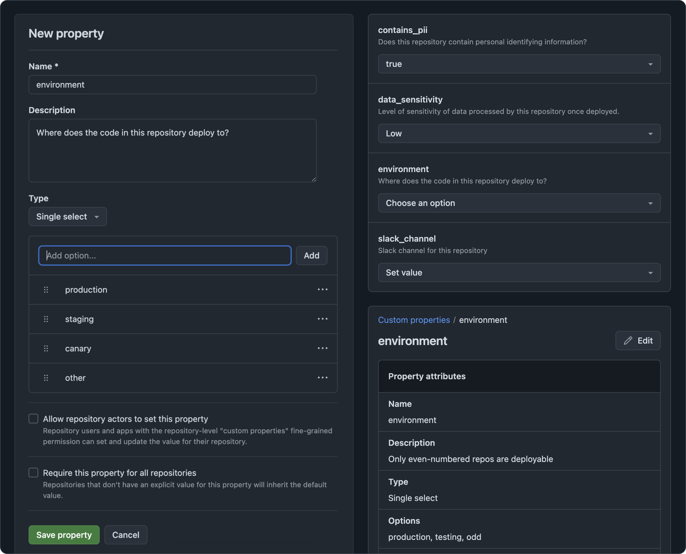
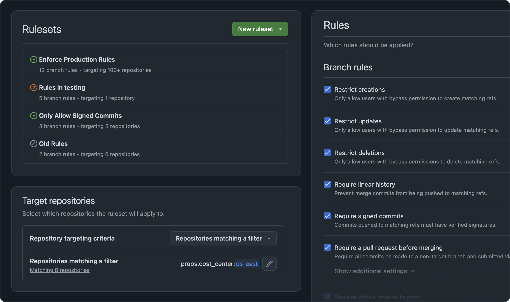

# Caleb Winters

_Santa Cruz, CA_

Hello, I'm Caleb. I'm an all-around product designer specializing in user experience and front-end code. I have a strong background with developer experience product design. I enjoy building design systems and working from a common set of shared components. 

Most recently I worked at GitHub where I helped to ship GitHub Projects, repository rules and properties, GitHub Marketplace, and more. 

## Selected Work

### GitHub Projects

Designed a 0-1 project management app that replaced the legacy Projects Classic. Started from scratch. Worked with PMs and engineers to shape, design, ship, and iterate on the app. Introduced custom fields and draft issues. Helped design some custom components that were later modified and added to our design system, Primer.

### Repository Governance

Designed and shipped features to help enterprise admins manage repository policy at scale. Worked with engineering to deliver a user experience that aligned with our API. 

### Repository Design Refresh

Refactored the design of the repository index, commits, and branches pages to align with Primer.

### GitHub Marketplace

Worked on self-service tools for developers to manage their Marketplace listings. Led a design refresh of the Marketplace to update the visual design and introduce GitHub Actions to the Marketplace.

## Experience

|  |  |  |
| --- | --- | --- |
| GitHub | Senior Product Designer | 2015-2025 |
| Screenbeacon | Founding Designer | 2014-2015 |
| ZURB | Senior Designer | 2012-2014 |
| Digital Corps | Software Designer | 2010-2012 |

## Contact

- **winters dot caleb** at gmail dotcom
- [LinkedIn](www.linkedin.com/in/calebwinters)
- [GitHub](https://github.com/cmwinters)